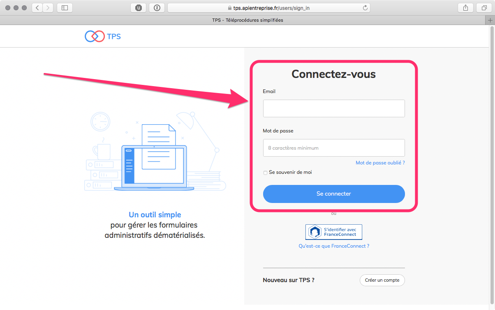
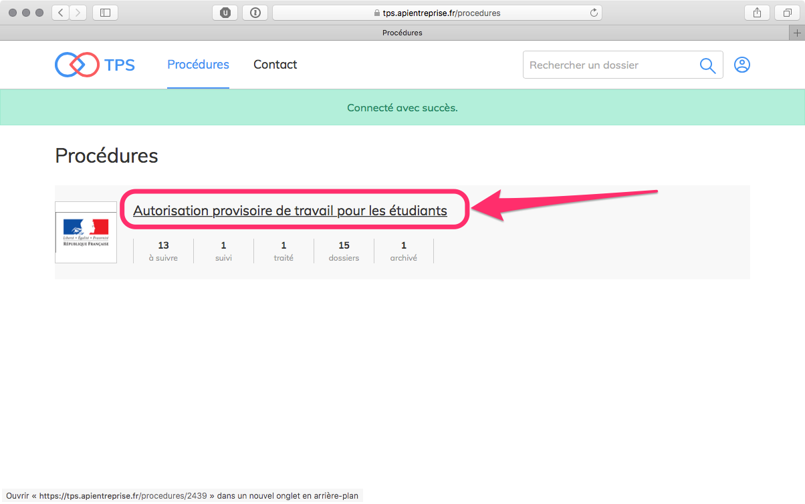
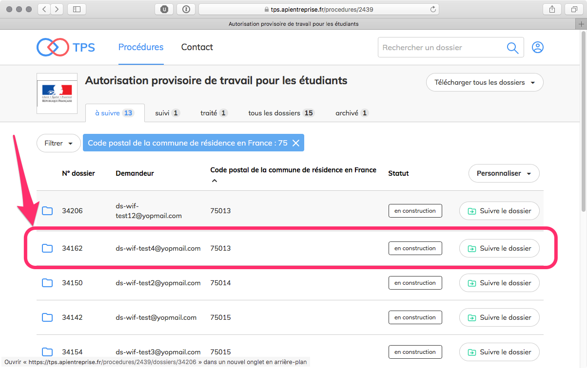
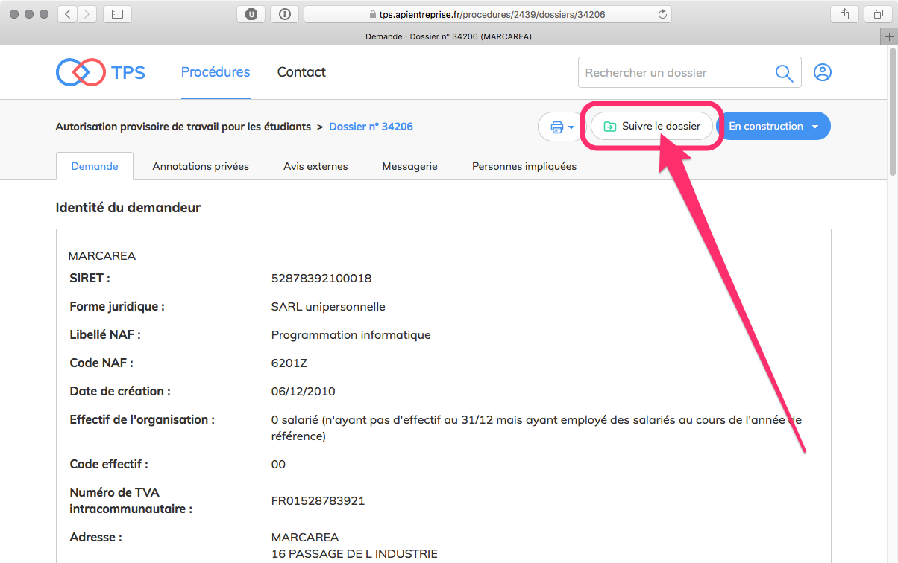
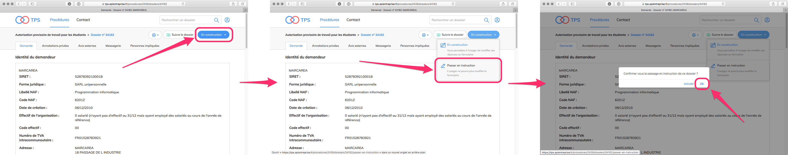
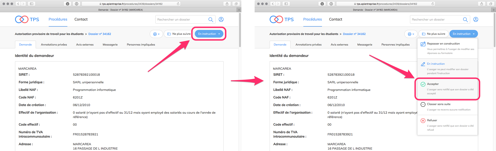
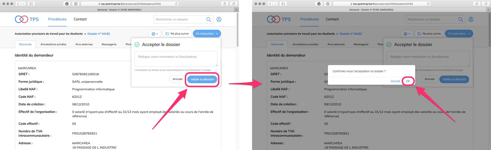

# Documentation accompagnateur

## 1. Se connecter à TPS

> [https://tps.apientreprise.fr/](https://tps.apientreprise.fr/)

## 2. Sélectionner la procédure

Cliquez sur la procédure ***Autorisation provisoire de travail pour les étudiants**** :

Allez dans l'onglet **« à suivre »** (normalement sélectionné par défaut). Un dossier dans l'onglet **« à suivre »** a le statut **« en construction »**. Il est consultable et modifiable par l'usager. Cliquez sur un dossier :

## 3. Suivre un dossier

Cliquez sur le bouton **« Suivre le dossier »** :

Suivre un dossier signifie s'attribuer le traitement du dossier. Plusieurs accompagnateurs peuvent suivre le même dossier.

Le dossier est alors transféré dans l'onglet **« suivi »**.

Le fait de suivre un dossier permet de recevoir des notifications sur les changements effectués sur ce dossier (nouveau message, nouvel avis, modification par l'usager).

## 4. Instruire un dossier

Cliquez sur le bouton **« En construction »** puis cliquez sur le bouton **« Passer en instruction »**. Confirmez votre choix en cliquant sur le bouton **« OK »** :

Un dossier en instruction n'est plus modifiable par l'usager.

Un message automatique est envoyé à l'usager au moment du passage en instruction afin de l'avertir qu'il ne peut plus modifier son dossier.

Les échanges de messages et de documents entre l'accompagnateur et l'usager restent possibles à travers la messagerie.

À ce stade vous pouvez encore revenir en arrière et choisir de modifier le statut du dossier pour le **« Repasser en construction »**.

## 5. Rendre une décision concernant le dossier

L'instruction du dossier peut aboutir à trois décisions : **« Accepter »**, **« Refuser »** et **« Classer sans suite »**.

Chaque décision est définitive et irrévocable.

Pour **« Accepter »** un dossier, cliquez sur le bouton **« En instruction »** puis cliquez sur le bouton **« Accepter »** :

Vous êtes invité à rédiger une motivation qui sera consultable par l'usager dans son dossier après acceptation. Cliquez sur le bouton **« Valider la décision »**. Confirmez votre choix en cliquant sur le bouton **« OK »** :

Un message automatique est envoyé à l'usager afin de le notifier de l'acceptation de son dossier.

Si vous décidez de **« Classer sans suite »** un dossier, aucun message de notification n'est envoyé à l'usager.

Lorsqu'une décision est prise, le dossier passe automatiquement dans l'onglet des dossiers traités. Son statut n'est plus modifiable.

## 6. Documentation complète

> [https://tps.gitbooks.io/tps-documentation/content/documentation/tutoriel-accompagnateur.html](https://tps.gitbooks.io/tps-documentation/content/documentation/tutoriel-accompagnateur.html)
